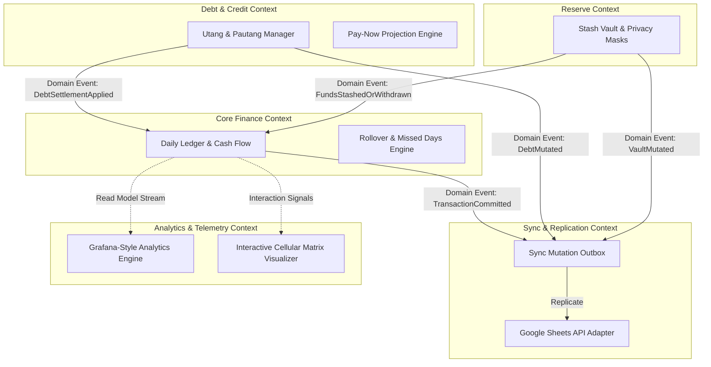
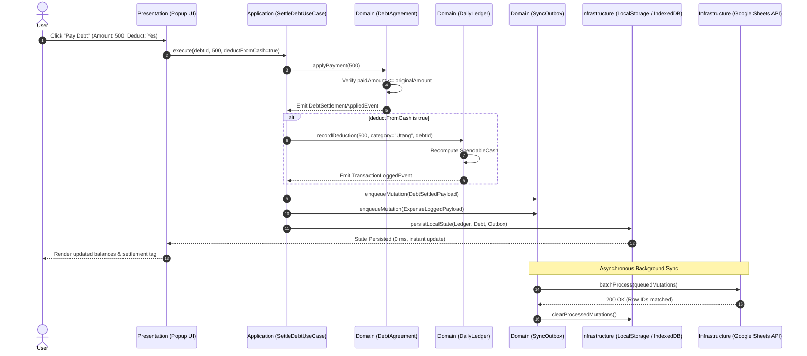

# Domain-Driven Design (DDD) Specification
## Personal Finance & Utang Tracker Architecture

**System Name:** Personal Finance & Utang Tracker  
**Target Environments:** Responsive Web App/PWA and cross-browser WebExtension (Firefox, Chromium, LibreWolf, Brave)
**Architecture Style:** Domain-Driven Design (DDD) with Hexagonal Architecture (Ports and Adapters)  
**Storage Model:** Offline-First with Persistent Local Outbox and Cloud Reconciliation  

---

## 1. System Vision and Core Philosophy

The Personal Finance & Utang Tracker is an offline-first financial operating system optimized for commuters, students, and disciplined individual budgeters. The core philosophy centers on:

1. **Zero-Latency Interactions:** State changes occur locally and synchronously within bounded domain rules; user interactions never wait on network I/O.
2. **Deterministic Financial Math:** Financial figures are strictly validated, preventing fractional floating-point corruption, unhandled negative balances, or out-of-order mutations.
3. **Decoupled Core Domain:** Core financial logic (ledger balancing, rollover carrying, debt settlement, pay-now projections) remains pure, testable in isolation, and decoupled from browser APIs, UI renderers, or remote cloud providers.

---

## 2. Strategic Design

### 2.1 Subdomain Classification

```
+-------------------------------------------------------------------------+
|                              CORE DOMAIN                                |
|  - Cash Ledger & Allowance Management                                   |
|  - Utang & Pautang (Debt/Credit) Management                             |
|  - Pay-Now Projection Engine                                            |
+-------------------------------------------------------------------------+
|                           SUPPORTING DOMAINS                            |
|  - Stash Vault (Reserve Asset Allocation)                               |
|  - Rollover & Calendar Streaks                                          |
|  - Two-Way Cloud Sync & Conflict Resolution                             |
+-------------------------------------------------------------------------+
|                            GENERIC SUBDOMAINS                           |
|  - Storage Serialization (WebExtension LocalStorage / File System)      |
|  - Google OAuth 2.0 Identity & Transport Layer                          |
|  - Observability & Canvas Telemetry Engine                              |
+-------------------------------------------------------------------------+
```

* **Core Domain:** What makes this system uniquely effective—instant daily allowance tracking, bidirectional personal debt tracking ("Utang Ko" vs. "Pautang"), and live projections of immediate liquid cash if all outstanding debts are settled today.
* **Supporting Domains:** Stash Vault reserve isolation, missed days rollover logic, and idempotent two-way sync queues.
* **Generic Subdomains:** OAuth authentication, transport protocols, browser storage serialization, and telemetry visualization.

---

### 2.2 Ubiquitous Language

The ubiquitous language guarantees unambiguous communication across engineering, specifications, documentation, and user interfaces:

| Term | Domain Context | Definition |
| :--- | :--- | :--- |
| **Spendable Cash** | Ledger | Liquid cash currently available for discretionary spending on the active calendar day. Excludes isolated reserve funds. |
| **Daily Allowance** | Ledger | Baseline cash allocated for a given day (e.g. daily transit + meal stipend). |
| **Expense** | Ledger | Immediate outflow of spendable cash tied to an active category and timestamp. |
| **Utang Ko (Payable)** | Debt & Credit | A liability: money borrowed from an external contact that must be repaid. Reduces net projected cash. |
| **Pautang (Receivable)** | Debt & Credit | An asset: money lent to an external contact that will be collected. Increases net projected cash when settled. |
| **Partial Settlement** | Debt & Credit | An incremental repayment that reduces the outstanding principal without closing the debt record. |
| **Pay-Now Projection** | Debt & Credit | The hypothetical liquid cash remaining if every active payable is paid and every active receivable is collected immediately. |
| **Stash Vault** | Savings & Reserves | An isolated capital pool segregated from daily spendable cash to prevent impulse spending. |
| **Rollover Delta** | Ledger | Surplus or deficit carried over from preceding calendar days into the active day. |
| **Missed Day** | Ledger | A calendar day between the installation anchor and today with zero logged activity. |
| **Sync Mutation** | Sync & Replication | An immutable event record queued in local persistent storage awaiting upstream replication to Google Sheets. |
| **Audit Snapshot** | Observability | An append-only historical log entry capturing the before-and-after state of any critical mutation. |

---

### 2.3 Bounded Contexts

The architecture is divided into five bounded contexts with explicit transactional boundaries:



#### Context Responsibilities:
1. **Core Finance Context:** Owns transaction history, daily allowances, category breakdowns, and spendable balances. Enforces balance consistency.
2. **Debt & Credit Context:** Owns counterparty debt agreements, principal calculations, partial repayment tracking, and pay-now projections.
3. **Reserve Context (Stash Vault):** Owns non-spendable reserve accounts, masking rules, and safe deposit/withdrawal validations.
4. **Sync & Replication Context:** Guarantees eventual consistency between local client state and Google Sheets through an idempotent, append-only outbox queue.
5. **Analytics Context:** Read-only projection of financial telemetry, streak calculations, burn rates, and background visualizer state.

---

## 3. Tactical Design

### 3.1 Aggregates and Aggregate Roots

```
+-------------------------------------------------------------------------+
| AGGREGATE ROOT: DailyLedger                                             |
+-------------------------------------------------------------------------+
| - ledgerDate: DateStr                                                   |
| - transactions: List<Transaction>                                       |
| - dailyAllowance: Money                                                 |
| - rolloverDelta: Money                                                  |
|                                                                         |
| Invariants:                                                             |
| 1. Every Transaction must possess an immutable UUID and valid DateStr.  |
| 2. Total Spendable Cash = Allowance + RolloverDelta - Sum(Expenses).   |
| 3. Deleting an Allowance transaction recalculates the daily baseline.  |
+-------------------------------------------------------------------------+

+-------------------------------------------------------------------------+
| AGGREGATE ROOT: DebtAgreement                                           |
+-------------------------------------------------------------------------+
| - debtId: UUID                                                          |
| - contactName: String                                                   |
| - direction: DebtDirection [OWED_BY_ME | OWED_TO_ME]                        |
| - originalAmount: Money                                                 |
| - paidAmount: Money                                                     |
| - status: DebtStatus [ACTIVE | PARTIAL | SETTLED]                       |
| - createdAt: Timestamp                                                  |
| - settledAt: Timestamp?                                                 |
|                                                                         |
| Invariants:                                                             |
| 1. paidAmount cannot exceed originalAmount.                             |
| 2. When paidAmount == originalAmount, status must be SETTLED.           |
| 3. Settlement payment must emit DebtSettlementApplied domain event.     |
+-------------------------------------------------------------------------+

+-------------------------------------------------------------------------+
| AGGREGATE ROOT: StashVault                                              |
+-------------------------------------------------------------------------+
| - vaultId: UUID                                                         |
| - entries: List<StashEntry>                                             |
| - isMasked: Boolean                                                     |
|                                                                         |
| Invariants:                                                             |
| 1. Total Stash Balance = Sum(StashEntry.amount).                        |
| 2. Deposit reduces DailyLedger.spendableCash by exact deposit amount.   |
| 3. Unstash (withdrawal) credits DailyLedger as an incoming Allowance.  |
+-------------------------------------------------------------------------+

+-------------------------------------------------------------------------+
| AGGREGATE ROOT: SyncOutbox                                              |
+-------------------------------------------------------------------------+
| - queuedMutations: Queue<SyncMutation>                                  |
| - lastSyncTimestamp: Timestamp?                                         |
| - isLocked: Boolean                                                     |
|                                                                         |
| Invariants:                                                             |
| 1. Mutations are strictly ordered by local sequence timestamp.          |
| 2. A mutation is only purged upon verified 200 OK from Sheets API.      |
| 3. Retries must maintain idempotency via entity UUID deduplication.     |
+-------------------------------------------------------------------------+
```

---

### 3.2 Entities and Value Objects

#### Value Objects (Immutable, Equality by Value):
* **`Money`:** Encapsulates integer/decimal quantity and ISO-4217 currency (`PHP`). Arithmetic operations enforce non-nullness and prevent float rounding leaks.
* **`DateStr`:** Formatted `YYYY-MM-DD` representation of local calendar dates, preventing timezone skew across date boundaries.
* **`Category`:** Standardized expense classifications (`Food`, `Transport`, `Bills`, `Utang`, `Personal`, `Allowance`, `Other`).
* **`AuditLogEntry`:** Append-only record capturing `actionType`, `targetId`, `timestamp`, `details`, and `clientVersion`.

#### Entities (Identity-Based, State Transitions):
* **`Transaction`:** Identified by `id`. Mutable properties: `amount`, `category`, `description`, `date`.
* **`DebtRecord`:** Identified by `id`. Tracks repayment history, borrower/lender name, remaining principal balance, and settlement timestamps.
* **`StashEntry`:** Identified by `id`. Represents an individual reserve envelope with goal label and balance.

---

### 3.3 Domain Events

Domain events represent facts that have occurred within the domain and serve as the asynchronous communication contract between bounded contexts:

| Domain Event | Emitted By | Handled By | Payload |
| :--- | :--- | :--- | :--- |
| `TransactionLogged` | `DailyLedger` | `SyncOutbox`, `TelemetryEngine` | `transactionId`, `amount`, `category`, `type`, `date` |
| `TransactionDeleted` | `DailyLedger` | `SyncOutbox`, `TelemetryEngine` | `transactionId`, `date` |
| `DebtRecorded` | `DebtAgreement` | `SyncOutbox`, `PayNowEngine` | `debtId`, `contact`, `direction`, `amount` |
| `DebtSettlementApplied` | `DebtAgreement` | `DailyLedger`, `SyncOutbox` | `debtId`, `settlementAmount`, `direction`, `affectsCashBalance: Boolean` |
| `FundsStashed` | `StashVault` | `DailyLedger`, `SyncOutbox` | `stashId`, `amount`, `label` |
| `FundsUnstashed` | `StashVault` | `DailyLedger`, `SyncOutbox` | `stashId`, `amount`, `destinationDate` |
| `SyncBatchProcessed` | `SyncOutbox` | `DailyLedger`, `AuditLog` | `processedCount`, `remainingQueueSize`, `timestamp` |

---

### 3.4 Domain Services

When an operation involves business rules across multiple aggregates, it is encapsulated in a pure Domain Service:

1. **`PayNowProjectionService`:**
   * **Input:** `DailyLedger.currentCash`, `List<DebtAgreement>`
   * **Logic:**
     $$\text{ProjectedNetCash} = \text{CurrentCash} + \sum \text{Receivables}_{\text{unpaid}} - \sum \text{Payables}_{\text{unpaid}}$$
   * **Rule:** If $\text{ProjectedNetCash} < 0$, flag insolvency warning status.

2. **`DailyRolloverService`:**
   * **Input:** `List<Transaction>`, `startDate: DateStr`, `today: DateStr`, `stashes: List<StashEntry>`
   * **Logic:** Calculates running net cash for each day in sequence:
     $$\text{EndOfDayBalance}_{D} = \text{Allowance}_{D} - \text{Expenses}_{D} + \text{EndOfDayBalance}_{D-1}$$
   * **Rule:** Missed days (no transactions logged) carry forward the prior day's closing balance without creating artificial synthetic transactions.

---

## 4. Hexagonal Architecture (Ports & Adapters)

The static web client and WebExtension share two browser-compatible layers:

* `shared/domain.js` is the pure domain model. It owns money parsing, ledger projections,
  debt arithmetic, and stash invariants without queue, storage, network, or DOM concerns.
* `shared/application.js` contains use cases. It coordinates domain services with immutable
  state transitions and sync mutations, but still has no browser, storage, network, or DOM
  dependencies. It is packaged as `docs/shared/application.js` and
  `extension/shared/application.js`.

The popup scripts are presentation adapters. They own event handlers, prompts, rendering,
browser storage, and Google API calls, and delegate business actions to the application layer:

* transaction, debt, and stash use cases;
* immutable sync-queue mutation;
* settings updates; and
* deterministic cloud-state merging.

Both layers deliberately use global namespaces rather than ES module syntax so they work when
loaded by static HTML and WebExtension manifests without a build step. The synchronization
adapter owns network orchestration while the application layer owns the state merge and
settings invariants.

Static presentation assets are also synchronized: `docs/styles/app.css` and
`extension/styles/app.css` contain the shared stylesheet, while each HTML entry point keeps
only its client-specific markup and script loading order.

The client infrastructure is split into small browser adapters as well: `client/state.js`
owns in-memory state and browser persistence, while `client/status.js` owns status and sync
badge presentation. Feature controllers remain next candidates for extraction from the
large popup adapter. `client/background.js` owns the Conway, ambient-orb, and telemetry
canvas presentation subsystem. `client/analytics.js` and `client/calendar.js` own the
analytics and calendar/chronometer presentation subsystems respectively.
Feature-specific presentation controllers are extracted incrementally; the transaction
controller now owns entry submission and transaction mutation UI orchestration.
The debt controller similarly owns debt entry, settlement, deletion, and settlement-modal
presentation orchestration while delegating state transitions to `FinanceApplication`.
The stash controller owns reserve creation, unstashing, deletion, and stash rendering
presentation behavior.
The presets controller owns quick-entry preset management and its modal presentation.
The sync controller owns cloud hydration, queue flushing, OAuth login state, export, and
reset orchestration while `google_sync.js` remains the transport adapter.

The Settings modal exposes the persisted `disableBgAnimation` state as **Pause Live Conway
Animation**. Pausing cancels the pending animation frame and prevents subsequent animation
work until the setting is resumed.

This establishes the current hexagonal boundary; further UI extraction can extend it as the
application grows:

```
+-------------------------------------------------------------------------------+
|                             PRESENTATION ADAPTERS                             |
|    [Web App / PWA]     [Browser Popup WebExtension]     [Desktop App Window]   |
+-------------------------------------------------------------------------------+
                                      |
                                      v
+-------------------------------------------------------------------------------+
|                       APPLICATION LAYER (INBOUND PORTS)                       |
|   - RecordExpenseUseCase               - SettleDebtUseCase                    |
|   - DepositStashUseCase                - ReconcileSheetsSyncUseCase           |
|   - ComputeProjectionsUseCase          - RunDailyRolloverUseCase              |
|   - UpdateSettingsUseCase              - MergeCloudStateUseCase               |
+-------------------------------------------------------------------------------+
                                      |
                                      v
+-------------------------------------------------------------------------------+
|                                 DOMAIN LAYER                                  |
|   Aggregates:  DailyLedger, DebtAgreement, StashVault, SyncOutbox             |
|   Value Obj:   Money, DateStr, Category, AuditLogEntry                        |
|   Domain Svc:  PayNowProjectionService, DailyRolloverService                  |
+-------------------------------------------------------------------------------+
                                      |
                                      v
+-------------------------------------------------------------------------------+
|                      INFRASTRUCTURE LAYER (OUTBOUND PORTS)                    |
|  [ILedgerRepository]   [IDebtRepository]   [ISyncGateway]   [IIdentityManager]|
|           |                    |                 |                 |          |
|  chrome.storage.local   SQLite/JSON DB    Google Sheets API   OAuth2 Token Svc|
+-------------------------------------------------------------------------------+
```

### 4.1 Inbound Ports (Application Use Cases)
* `recordExpense(amount, category, description, date)`
* `recordDebt(contact, direction, amount, affectsCash)`
* `settleDebt(debtId, paymentAmount, deductCash)`
* `depositToStash(name, amount)`
* `unstashToFinance(stashId, amount)`
* `executeTwoWaySync()`

### 4.2 Outbound Ports (Infrastructure Interfaces)
* `ILedgerRepository`: `getTransactions(query): List<Transaction>`, `save(transaction): Void`, `delete(id): Void`
* `IDebtRepository`: `getDebts(): List<DebtAgreement>`, `save(debt): Void`, `update(debt): Void`
* `IStashRepository`: `getStashes(): List<StashEntry>`, `save(stash): Void`
* `ISyncOutboxRepository`: `enqueue(mutation): Void`, `peekBatch(size): List<SyncMutation>`, `dequeue(ids): Void`
* `IGoogleSheetsGateway`: `readSheetData(spreadsheetId): SheetDataset`, `appendRows(spreadsheetId, rows): Void`, `batchUpdate(spreadsheetId, updates): Void`

---

## 5. Mutation & Synchronization Lifecycle

The following sequence diagram illustrates the lifecycle of a debt settlement that interacts with cash balance, outbox queuing, and cloud reconciliation:



---

## 6. Security and Offline Invariants

1. **Deterministic Data Integrity:**
   * Money values in domain logic are strictly positive numbers.
   * Cash balance deductions are recorded as positive expenditure amounts against the ledger rather than negative mathematical quantities.
2. **Formula Injection Sanitization:**
   * All user-supplied strings (`description`, `contactName`, `label`) pass through formula prefix neutralization before reaching outbound sync adapters (neutralizing leading `=`, `+`, `-`, `@` triggers).
3. **Data Residency & Anonymity:**
   * Domain state resides exclusively on the client machine and the user's private Google Drive.
   * Zero external telemetric or operational tracking data is collected, satisfying the `data_collection_permissions: { required: ["none"] }` privacy specification.

---

## 7. Future Expansion Roadmap

With the Domain-Driven Design foundation established, subsequent milestones can be executed without refactoring domain rules:

1. **Multi-Currency Aggregate Extension:**
   * Enhance `Money` Value Object with currency exchange rates and automatic conversion lookup.
2. **Multi-Account Bounded Context:**
   * Introduce `Account` Aggregate Root (e.g. Bank Account, Physical Wallet, E-Wallet) supporting intra-account transfers.
3. **Alternative Persistence Adapters:**
   * Implement an `SQLiteLedgerRepository` port for a native desktop application (Tauri/Electron) or terminal daemon without changing a single line of business logic in the Domain Layer.
4. **End-to-End Automated Domain Test Suite:**
   * Pure unit tests validating aggregate invariants independently of the DOM, browser polyfills, or Google Sheets network calls.
